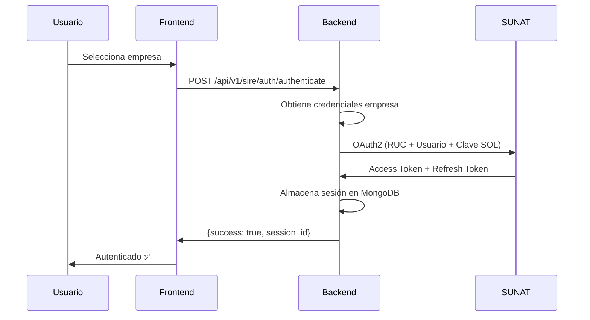
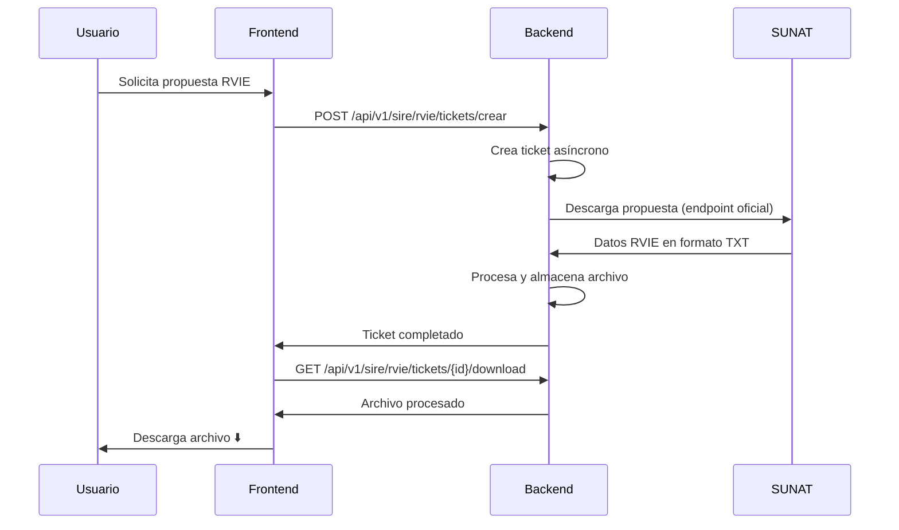
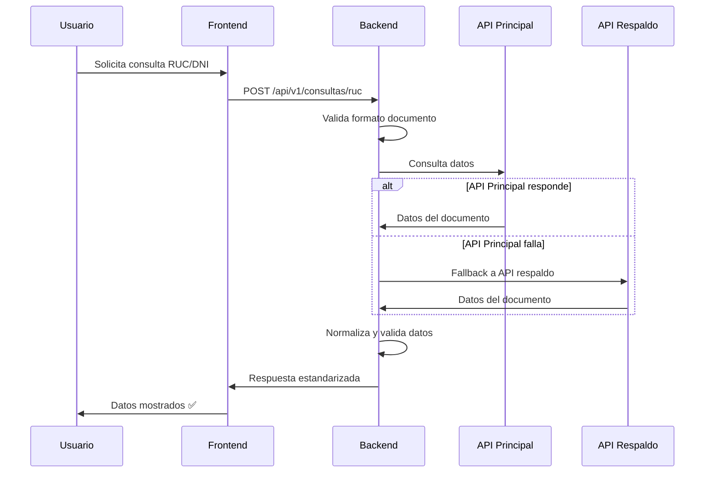
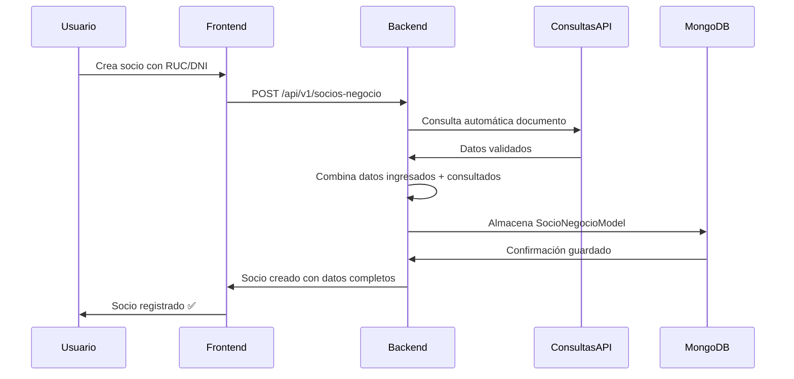

# 🏗️ Backend ERP - Documentación Técnica Completa

## 📋 Índice
1. [Visió└── modules/              # 📦 Módulos de dominio
       ├── companies/        # 🏢 Gestión empresas
       ├── accounting/       # 📊 Módulo contable
       ├── consultasapi/     # 🔍 Consultas RUC/DNI APIs públicas
       ├── socios_negocio/   # 🤝 Gestión socios de negocio
       └── sire/            # 🇵🇪 Integración SUNAT SIREneral](#-visión-general)
2. [Arquitectura](#-arquitectura)
3. [Estructura de Directorios](#-estructura-de-directorios)
4. [Módulos Principales](#-módulos-principales)
5. [Flujos de Trabajo](#-flujos-de-trabajo)
6. [API Endpoints](#-api-endpoints)
7. [Base de Datos](#-base-de-datos)
8. [Configuración](#-configuración)
9. [Seguridad](#-seguridad)
10. [Mantenimiento](#-mantenimiento)

---

## 🎯 Visión General

### Stack Tecnológico
- **Framework**: FastAPI 
- **Base de Datos**: MongoDB (Motor - driver asíncrono)
- **Arquitectura**: Domain-Driven Design (DDD)
- **Patrones**: Repository Pattern, Service Layer Pattern
- **Validación**: Pydantic v2
- **Documentación**: OpenAPI (Swagger)

### Propósito Principal
Sistema ERP contable especializado en **SUNAT SIRE** (Sistema Integrado de Registros Electrónicos) para empresas peruanas, con funciones de:
- **RVIE**: Registro de Ventas e Ingresos Electrónico
- **RCE**: Registro de Compras Electrónico  
- **Autenticación SUNAT**: OAuth2 + JWT
- **Gestión de Empresas**: CRUD y configuración
- **Consultas RUC/DNI**: Integración con APIs públicas SUNAT/RENIEC
- **Socios de Negocio**: Gestión completa con validación automática

---

## 🏛️ Arquitectura

### Principios de Diseño
```
┌─────────────────────┐
│    FastAPI Routes   │ ← HTTP Layer
├─────────────────────┤
│   Service Layer     │ ← Business Logic
├─────────────────────┤
│  Repository Layer   │ ← Data Access
├─────────────────────┤
│   MongoDB Models    │ ← Data Storage
└─────────────────────┘
```

### Patrón Modular DDD
- **Cada módulo** es independiente
- **Responsabilidad única** por dominio
- **Interfaces bien definidas** entre capas
- **Testeable** y mantenible

---

## 📁 Estructura de Directorios

```
backend/
├── app/
│   ├── main.py                 # 🚀 Punto de entrada FastAPI
│   ├── config.py              # ⚙️ Configuración global
│   ├── database.py            # 🗄️ Conexión MongoDB
│   ├── core/
│   │   └── router.py          # 🔗 Router principal
│   ├── shared/
│   │   └── exceptions.py      # ❌ Excepciones compartidas
│   ├── models/
│   │   └── user.py           # 👤 Modelos base de usuario
│   ├── routes/
│   │   ├── auth.py           # 🔐 Autenticación base
│   │   └── users.py          # 👥 Gestión usuarios
│   ├── services/
│   │   └── user_service.py   # 🔧 Servicios de usuario
│   └── modules/              # 📦 Módulos de dominio
│       ├── companies/        # 🏢 Gestión empresas
│       ├── accounting/       # 📊 Módulo contable
│       └── sire/            # 🇵🇪 Integración SUNAT SIRE
└── requirements.txt          # 📋 Dependencias
```

### 📦 Estructura de Módulo (Patrón DDD)
Cada módulo sigue esta estructura estricta:
```
module_name/
├── __init__.py
├── models.py          # 🗃️ Modelos MongoDB
├── schemas.py         # 📝 Esquemas Pydantic (Request/Response)
├── routes.py          # 🛤️ Endpoints FastAPI
├── services.py        # 🔧 Lógica de negocio
├── repositories.py    # 🗄️ Acceso a datos
└── utils/            # 🛠️ Utilidades específicas
```

---

## 🔧 Módulos Principales

### 1. 🏢 **Companies Module**
**Propósito**: Gestión completa de empresas con credenciales SIRE

**Archivos clave**:
- `models.py` - CompanyModel con credenciales SIRE
- `services.py` - CRUD empresas + validaciones
- `routes.py` - Endpoints REST API
- `repositories.py` - Operaciones MongoDB

**Funcionalidades**:
- ✅ Registro/edición de empresas
- ✅ Almacenamiento seguro de credenciales SUNAT
- ✅ Validación RUC peruano
- ✅ Gestión estado activo/inactivo

### 2. 🇵🇪 **SIRE Module** (Sistema Integrado SUNAT)
**Propósito**: Integración completa con SUNAT para registros electrónicos

#### Submódulos:

#### 🔐 **Auth (Autenticación)**
- `auth_service.py` - OAuth2 SUNAT
- `token_manager.py` - Gestión JWT tokens
- `credentials_manager.py` - Credenciales seguras

#### 📊 **RVIE (Registro Ventas)**
- `rvie_service.py` - Operaciones RVIE
- `rvie_ventas_service.py` - Especializado en ventas
- `rvie_flow_controller.py` - Flujo completo

#### 🎫 **Tickets System**
- `ticket_service.py` - Sistema de tickets asíncronos
- `ticket_repository.py` - Persistencia tickets

#### 🌐 **API Integration**
- `api_client.py` - Cliente HTTP SUNAT
- Endpoints oficiales SUNAT v25

### 3. 📈 **Accounting Module**
**Propósito**: Funciones contables básicas (en desarrollo)

### 4. 🔍 **Consultas API Module**
**Propósito**: Centralización de consultas a APIs públicas para validación de documentos peruanos

**Archivos clave**:
- `models.py` - Modelos para RUC y DNI
- `services/sunat_service.py` - Consultas RUC con múltiples APIs de respaldo
- `services/reniec_service.py` - Consultas DNI con APIs públicas
- `routes.py` - Endpoints REST para consultas
- `utils.py` - Validadores y utilidades

**Funcionalidades**:
- ✅ Consulta RUC con fallback a múltiples APIs
- ✅ Consulta DNI con APIs públicas RENIEC
- ✅ Validación y normalización de datos
- ✅ Respuesta estandarizada con metadatos
- ✅ Manejo de errores y timeouts

### 5. 🤝 **Socios Negocio Module**
**Propósito**: Gestión completa de socios de negocio con integración de consultas automáticas

**Archivos clave**:
- `models.py` - SocioNegocioModel con datos completos
- `services.py` - CRUD + integración con consultasapi
- `routes.py` - Endpoints REST API
- `repositories.py` - Operaciones MongoDB
- `utils/ruc_validator.py` - Validaciones específicas

**Funcionalidades**:
- ✅ CRUD completo de socios de negocio
- ✅ Consulta automática RUC/DNI vía consultasapi
- ✅ Validación de documentos peruanos
- ✅ Gestión de personas naturales y jurídicas
- ✅ Estado activo/inactivo

---

## 🔄 Flujos de Trabajo

### 🔐 **Flujo de Autenticación SIRE**


### 📄 **Flujo RVIE - Descarga Propuesta**


### 🏢 **Flujo Gestión Empresas**
```mermaid
sequenceDiagram
    participant U as Usuario
    participant F as Frontend
    parameter B as Backend
    participant M as MongoDB
    
    U->>F: Registra nueva empresa
    F->>B: POST /api/v1/companies
    B->>B: Valida RUC + datos
    B->>M: Almacena CompanyModel
    M->>B: ObjectId + confirmación
    B->>F: {id, ruc, razon_social}
    F->>U: Empresa registrada ✅
```

### 🔍 **Flujo Consulta RUC/DNI**


### 🤝 **Flujo Gestión Socios Negocio**


---

## 🛤️ API Endpoints

### 🏢 **Companies Endpoints**
```http
GET    /api/v1/companies              # Lista empresas
POST   /api/v1/companies              # Crear empresa
GET    /api/v1/companies/{id}         # Obtener empresa
PUT    /api/v1/companies/{id}         # Actualizar empresa
DELETE /api/v1/companies/{id}         # Eliminar empresa
PUT    /api/v1/companies/{id}/activate    # Activar empresa
PUT    /api/v1/companies/{id}/deactivate  # Desactivar empresa
```

### 🔐 **SIRE Auth Endpoints**
```http
POST   /api/v1/sire/auth/authenticate          # Autenticar en SUNAT
GET    /api/v1/sire/auth/sessions/{ruc}        # Estado sesión
DELETE /api/v1/sire/auth/sessions/{ruc}        # Cerrar sesión
POST   /api/v1/sire/auth/refresh               # Renovar token
```

### 📊 **SIRE RVIE Endpoints**
```http
# Tickets System
POST   /api/v1/sire/rvie/tickets/crear         # Crear ticket RVIE
GET    /api/v1/sire/rvie/tickets/{id}          # Estado ticket
GET    /api/v1/sire/rvie/tickets/{id}/download # Descargar resultado
GET    /api/v1/sire/rvie/tickets/ruc/{ruc}     # Tickets por RUC

# Operaciones Directas  
POST   /api/v1/sire/rvie/ventas/descargar      # Descarga directa propuesta
GET    /api/v1/sire/rvie/ventas/comprobantes   # Listar comprobantes
```

### 🔧 **SIRE Maintenance Endpoints**
```http
POST   /api/v1/sire/maintenance/cleanup/tickets   # Limpiar tickets expirados
POST   /api/v1/sire/maintenance/cleanup/files     # Limpiar archivos antiguos
GET    /api/v1/sire/maintenance/stats             # Estadísticas sistema
```

### 🔍 **Consultas API Endpoints**
```http
POST   /api/v1/consultas/ruc                      # Consultar RUC
POST   /api/v1/consultas/dni                      # Consultar DNI
```

### 🤝 **Socios Negocio Endpoints**
```http
GET    /api/v1/socios-negocio                     # Lista socios
POST   /api/v1/socios-negocio                     # Crear socio
GET    /api/v1/socios-negocio/{id}                # Obtener socio
PUT    /api/v1/socios-negocio/{id}                # Actualizar socio
DELETE /api/v1/socios-negocio/{id}                # Eliminar socio
POST   /api/v1/socios-negocio/consulta-ruc        # Consultar RUC específico
POST   /api/v1/socios-negocio/consulta-dni        # Consultar DNI específico
```

---

## 🗄️ Base de Datos (MongoDB)

### Colecciones Principales

#### 📊 **companies**
```javascript
{
  "_id": ObjectId,
  "ruc": "20123456789",           // RUC 11 dígitos
  "razon_social": "Mi Empresa SAC",
  "direccion": "Av. Lima 123",
  "telefono": "+51-1-1234567",
  "email": "contacto@empresa.com",
  "representante_legal": "Juan Pérez",
  "is_active": true,
  "created_at": ISODate,
  "updated_at": ISODate,
  
  // Credenciales SIRE (cifradas)
  "sire_credentials": {
    "client_id": "encrypted_client_id",
    "client_secret": "encrypted_secret", 
    "usuario_sol": "encrypted_user",
    "clave_sol": "encrypted_password",
    "is_configured": true
  }
}
```

#### 🔐 **sire_sessions**
```javascript
{
  "_id": ObjectId,
  "ruc": "20123456789",
  "access_token": "jwt_token_here",
  "refresh_token": "refresh_token_here", 
  "expires_at": ISODate,
  "created_at": ISODate,
  "is_active": true,
  "session_metadata": {
    "user_agent": "...",
    "ip_address": "..."
  }
}
```

#### 🎫 **sire_tickets**
```javascript
{
  "_id": ObjectId,
  "ticket_id": "TICKET_20240818_001",
  "ruc": "20123456789",
  "operation_type": "DESCARGAR_PROPUESTA",
  "operation_params": {
    "periodo": "202412",
    "cod_tipo_archivo": 0
  },
  "status": "TERMINADO",           // PENDIENTE, PROCESANDO, TERMINADO, ERROR
  "status_message": "Completado exitosamente",
  "progress_percentage": 100.0,
  "priority": "NORMAL",
  "estimated_duration": 30,
  "created_at": ISODate,
  "updated_at": ISODate,
  "expires_at": ISODate,
  
  // Resultado cuando está completado
  "output_file_name": "RVIE_20123456789_202412_20240818.txt",
  "output_file_size": 15420,
  "output_file_type": "txt",
  "output_file_hash": "sha256_hash"
}
```

#### 🤝 **socios_negocio**
```javascript
{
  "_id": ObjectId,
  "numero_documento": "20123456789",     // RUC o DNI
  "tipo_documento": "RUC",               // RUC, DNI
  "nombre": "EMPRESA DEMO SAC",          // Razón social o nombres
  "direccion": "Av. Lima 123",
  "telefono": "+51-1-1234567",
  "email": "contacto@empresa.com",
  "is_active": true,
  "tipo_persona": "JURIDICA",            // NATURAL, JURIDICA
  "created_at": ISODate,
  "updated_at": ISODate,
  
  // Datos específicos según tipo
  "datos_sunat": {
    "estado": "ACTIVO",
    "condicion": "HABIDO",
    "ubigeo": "150101",
    "actividad_economica": "Comercio al por mayor"
  },
  
  // Para personas naturales
  "datos_reniec": {
    "nombres": "JUAN CARLOS",
    "apellido_paterno": "PÉREZ",
    "apellido_materno": "GARCÍA",
    "estado_civil": "SOLTERO"
  }
}
```

### Índices Recomendados
```javascript
// Empresas
db.companies.createIndex({"ruc": 1}, {unique: true})
db.companies.createIndex({"is_active": 1})

// Sesiones SIRE
db.sire_sessions.createIndex({"ruc": 1}, {unique: true})
db.sire_sessions.createIndex({"expires_at": 1})
db.sire_sessions.createIndex({"is_active": 1})

// Tickets SIRE
db.sire_tickets.createIndex({"ticket_id": 1}, {unique: true})
db.sire_tickets.createIndex({"ruc": 1, "created_at": -1})
db.sire_tickets.createIndex({"status": 1})
db.sire_tickets.createIndex({"expires_at": 1})

// Socios de Negocio
db.socios_negocio.createIndex({"numero_documento": 1}, {unique: true})
db.socios_negocio.createIndex({"tipo_documento": 1})
db.socios_negocio.createIndex({"is_active": 1})
db.socios_negocio.createIndex({"created_at": -1})
```

---

## ⚙️ Configuración

### Variables de Entorno (.env)
```bash
# Base de datos
MONGODB_URL=mongodb://localhost:27017/erp_db

# Aplicación
DEBUG=True
ENVIRONMENT=development
SECRET_KEY=tu-clave-super-secreta-aqui

# CORS (JSON array o separado por comas)
CORS_ORIGINS=["http://localhost:5173","http://localhost:3000"]

# Archivos SIRE
SIRE_FILE_STORAGE=./temp/sire_files

# Logging
LOG_LEVEL=INFO
```

### Configuración por Ambiente

#### **Desarrollo**
```python
DEBUG=True
ENVIRONMENT=development
MONGODB_URL=mongodb://localhost:27017/erp_db_dev
```

#### **Producción**
```python
DEBUG=False  
ENVIRONMENT=production
MONGODB_URL=mongodb://production-server:27017/erp_db
```

---

## 🔒 Seguridad

### Autenticación y Autorización
- **SUNAT OAuth2**: Integración oficial con endpoints SUNAT
- **JWT Tokens**: Gestión segura de sesiones
- **Refresh Tokens**: Renovación automática sin re-autenticación

### Protección de Datos
- **Credenciales Cifradas**: Almacenamiento seguro en MongoDB
- **Validación Strict**: Pydantic en todos los endpoints
- **CORS Configurado**: Control de acceso por origen

### Buenas Prácticas
- ✅ **No logs sensibles**: Credenciales nunca en logs
- ✅ **Timeouts configurados**: Evitar conexiones colgadas
- ✅ **Validación RUC**: Solo RUCs válidos peruanos
- ✅ **Rate Limiting**: Control de requests por cliente

---

## 🧪 Testing y Desarrollo

### Archivos de Testing
```
backend/
├── test_endpoints_oficiales.py    # Tests endpoints SUNAT
├── test_rvie_correcto.py          # Tests RVIE específicos
├── test_sire_integration.py       # Tests integración SIRE
├── test_socios_negocio_basic.py   # Tests socios de negocio
├── diagnostico_propuestas.py      # Diagnóstico propuestas
└── token_fresco_postman.py        # Utilidad tokens
```

### Comandos de Desarrollo
```bash
# Ejecutar servidor desarrollo
cd backend && uvicorn app.main:app --reload

# Con variables específicas
DEBUG=True uvicorn app.main:app --reload --port 8000

# Testing específico
python test_endpoints_oficiales.py
python test_socios_negocio_basic.py

# Probar consultas API
curl -X POST "http://localhost:8000/api/v1/consultas/ruc" \
     -H "Content-Type: application/json" \
     -d '{"ruc": "20100022479"}'
```

---

## 🔧 Mantenimiento

### Tareas Automáticas
```python
# Limpieza tickets expirados
POST /api/v1/sire/maintenance/cleanup/tickets

# Limpieza archivos antiguos (>7 días)
POST /api/v1/sire/maintenance/cleanup/files

# Estadísticas del sistema
GET /api/v1/sire/maintenance/stats
```

### Monitoreo
- **Health Check**: `/docs` (en desarrollo)
- **Métricas MongoDB**: Conexiones activas
- **Logs Estructurados**: FastAPI access logs
- **Performance**: Tiempo respuesta endpoints

### Backup Estrategia
- **MongoDB**: Backup diario automático
- **Archivos SIRE**: Retención 30 días
- **Configuración**: Versionado en Git

---

## 🚀 Deployment

### Requerimientos Mínimos
- **Python**: 3.11+
- **MongoDB**: 5.0+
- **RAM**: 2GB mínimo
- **Storage**: 10GB para archivos SIRE

### Proceso de Deploy
1. **Preparar entorno**:
   ```bash
   python -m venv venv
   source venv/bin/activate  # Linux/Mac
   # o venv\Scripts\activate  # Windows
   pip install -r requirements.txt
   ```

2. **Configurar variables**:
   - Copiar `.env.example` a `.env`
   - Configurar `MONGODB_URL` producción
   - Generar `SECRET_KEY` seguro

3. **Ejecutar**:
   ```bash
   uvicorn app.main:app --host 0.0.0.0 --port 8000
   ```

### Docker (Opcional)
```dockerfile
FROM python:3.11-slim
WORKDIR /app
COPY requirements.txt .
RUN pip install -r requirements.txt
COPY . .
CMD ["uvicorn", "app.main:app", "--host", "0.0.0.0", "--port", "8000"]
```

---

## 📚 Referencias

### Documentación SUNAT
- **Manual SIRE v25**: Endpoints oficiales implementados
- **OAuth2 SUNAT**: Flujo de autenticación oficial
- **Formatos RVIE**: Estructura archivos TXT

### Tecnologías
- [FastAPI Documentation](https://fastapi.tiangolo.com/)
- [Motor (MongoDB Async)](https://motor.readthedocs.io/)
- [Pydantic V2](https://docs.pydantic.dev/latest/)

---

## 🤝 Contribución

### Agregar Nuevo Módulo
1. Crear estructura en `app/modules/nuevo_modulo/`
2. Implementar patrón: `models.py`, `schemas.py`, `routes.py`, `services.py`, `repositories.py`
3. Registrar en `core/router.py`
4. Agregar tests correspondientes

### Modificar Funcionalidad Existente
1. Identificar módulo en esta documentación
2. Modificar capa correspondiente (Service → Repository → Model)
3. Actualizar schemas si cambia API
4. Ejecutar tests antes de commit

---

**📝 Documento actualizado**: Agosto 2025  
**🔧 Mantenido por**: Equipo Backend ERP  
**📞 Contacto**: Para dudas sobre implementación específica de SUNAT SIRE

---

## 📋 Changelog Reciente

### ✅ **Agosto 2025 - Módulo Consultas API y Socios de Negocio**
- **Nuevo**: Módulo `consultasapi` para centralizar consultas RUC/DNI
- **Nuevo**: Módulo `socios_negocio` con integración automática de consultas
- **Mejora**: APIs públicas con fallback automático para mayor disponibilidad
- **Mejora**: Validación y normalización de datos de documentos peruanos
- **Integración**: Desacoplamiento de lógica de consultas del módulo SIRE
- **Testing**: Pruebas funcionales de endpoints RUC/DNI
